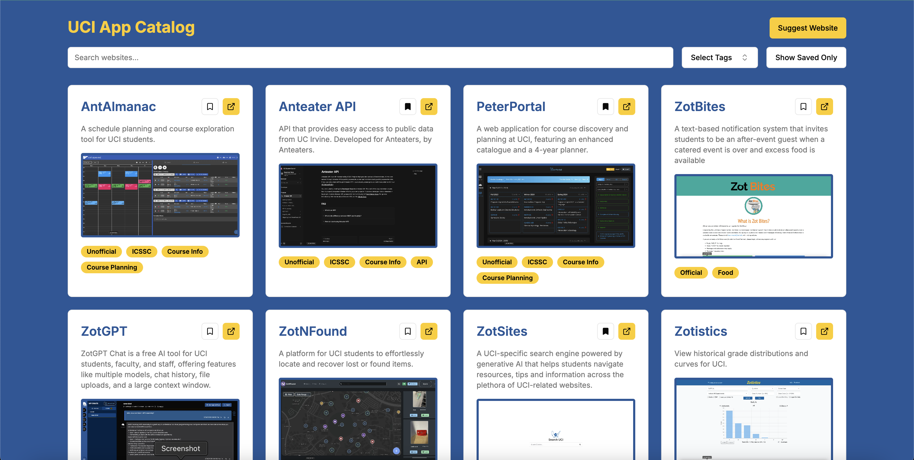

<h1 align="center">UCI App Catalog</h1>

<h3 align="center">An unofficial collection of uci-related websites and apps. Find, save, and suggest websites for yourself to others to use while at UCI to make your daily lives better!

</h3>

## About

My name is Charlie Weinberger, and I'm a 2nd year computer science major at UCI. I've recently noticed that many of my peers at UCI have created awesome websites or apps but are having trouble getting others to use their projects. To solve this problem, I set out to create a collection of such apps, with the goal of making it easier for UCI students to find all sorts of helpful tools to guide them through their time at UCI.

The UCI App Catalog features a growing collection of UCI-related apps, with a focus on student-developed projects. Users can search for and filter the available list of apps, as well as save apps which they find most useful. If a user wishes to add an app to the catalog, they can submit a request to have the app added, at which point I can review the app and add it to the catalog.

## Tech Stack

- Frontend: React, Next.js, TypeScript
- Styling: Tailwind CSS, shadcn/ui
- Deployment & analytics: Vercel
- Email (for suggestions): Resend